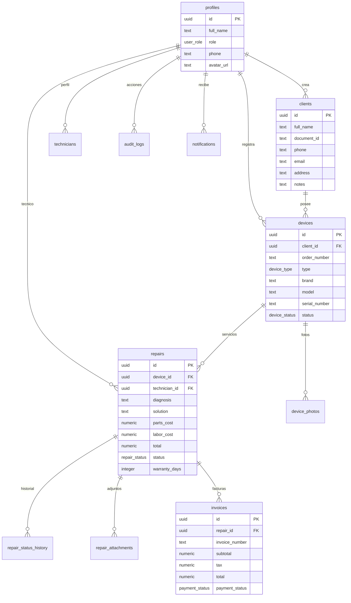

# Esquema Visual De Base De Datos

```mermaid
erDiagram
  profiles ||--o{ clients : "crea"
  profiles ||--o{ devices : "registra"
  profiles ||--o{ repairs : "tecnico"
  profiles ||--o{ technicians : "perfil"
  profiles ||--o{ audit_logs : "acciones"
  clients ||--o{ devices : "posee"
  devices ||--o{ device_photos : "fotos"
  devices ||--o{ repairs : "servicios"
  repairs ||--o{ repair_status_history : "historial"
  repairs ||--o{ repair_attachments : "adjuntos"
  repairs ||--o{ invoices : "facturas"
  profiles ||--o{ notifications : "recibe"

  profiles {
    uuid id PK
    text full_name
    user_role role
    text phone
    text avatar_url
  }

  clients {
    uuid id PK
    text full_name
    text document_id
    text phone
    text email
    text address
    text notes
  }

  devices {
    uuid id PK
    uuid client_id FK
    text order_number
    device_type type
    text brand
    text model
    text serial_number
    device_status status
  }

  repairs {
    uuid id PK
    uuid device_id FK
    uuid technician_id FK
    text diagnosis
    text solution
    numeric parts_cost
    numeric labor_cost
    numeric total
    repair_status status
    integer warranty_days
  }

  invoices {
    uuid id PK
    uuid repair_id FK
    text invoice_number
    numeric subtotal
    numeric tax
    numeric total
    payment_status payment_status
  }
```
